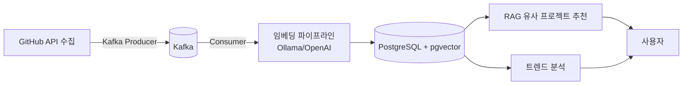

# CodeScope

GitHub 트렌딩 레포를 수집·임베딩하여 RAG 기반 유사 프로젝트 추천과 트렌드 분석을 제공하는 플랫폼.

## 왜 만들었는가

GitHub Trending은 순위만 보여줄 뿐 "왜 뜨는가", "내가 기여할 수 있는가", "내 스택과 맞는 프로젝트가 어디 있는가"는 알려주지 않는다. 실시간 수집과 AI 분석, 벡터 유사도 검색을 결합해 이 질문에 답해보려는 학습 목적 프로젝트다.

## 아키텍처



수집 → Kafka → 임베딩 → pgvector 저장 → RAG 추천 / 트렌드 분석 순으로 이어지는 파이프라인이다. 중간 단계 실패로 임베딩이 없는 레포가 섞이지 않도록, RAG 추천 쿼리는 `ProcessStatus=EMBEDDED`인 레포만 대상으로 한다.

## 기술 스택

| 기술 | 선택 이유 |
|---|---|
| Java 21 (가상 스레드) | GitHub·AI·DB 호출처럼 I/O 대기가 많은 구조에 적합 |
| Spring Boot 3.5 | 생태계와 가상 스레드 지원이 성숙한 백엔드 프레임워크 |
| PostgreSQL + pgvector | 별도 벡터 DB 없이 기존 트랜잭션 안에서 벡터 검색 처리 |
| Redis | 트렌드 랭킹(Sorted Set)·캐싱·중복 수집 방지 락에 활용 |
| Kafka | 브로커에 영속 저장되어 앱 재시작에도 작업이 유실되지 않음 |
| Flyway | 스키마 변경 이력을 코드로 관리해 팀/환경 간 정합성 확보 |
| Ollama | 로컬 환경에서 비용 없이 임베딩·생성 모델을 실험 |
| GitHub OAuth + JWT | 서비스 정체성과 맞고, 비밀번호 직접 관리 부담을 줄임 |
| Next.js | 프론트엔드 |
| kind (로컬 K8s) | 로컬에서 실제 K8s 환경을 그대로 재현 |
| GitHub Actions + ArgoCD | CI/CD와 GitOps 기반 배포 자동화 |

## 부하테스트 및 모니터링

배압 제어(세마포어)를 켰을 때와 껐을 때의 차이를 실측으로 확인하기 위해 아래 도구들을 함께 사용했다.

- **JMeter**: GUI 기반으로 시나리오 설계가 쉬워 초기 부하 시나리오 구성에 사용
- **k6**: 스크립트(JS) 기반이라 코드로 관리하고 CI에 연동하기 쉬움
- **InfluxDB + Grafana**: 부하테스트 중 응답시간/처리량을 시계열로 실시간 시각화
- **JDK Mission Control (JFR)**: 가상 스레드 pinning(`jdk.VirtualThreadPinned`) 여부를 관찰

## 성능 실측 요약

> 측정 환경: 로컬 kind 클러스터(k8s), 12 logical processors, GPU 없음(Ollama는 CPU-only 추론). 출처: `docs/performance/`

| 항목 | 조건 | 결과 |
|---|---|---|
| pgvector 검색 (DB 실행, `EXPLAIN ANALYZE`) | repo_embeddings 20행 / github_repository 30행 중 EMBEDDED 3행 | Execution Time 2.257ms |
| pgvector 검색 (앱 측, HikariCP 커넥션 포함) | 앱 재시작 후 첫 호출(콜드) | 3134ms |
| pgvector 검색 (앱 측, HikariCP 커넥션 포함) | 두 번째 호출부터(웜) | 185ms |
| RAG 생성(LLM) | llama3.2:3b, num_predict=200, 워밍업 상태 | eval 91.07초(1.68 tok/s) / 전체 142.76초 |
| 트렌드 분석 캐시 미스 | 1차 호출(LLM 실제 호출) | 71.24초 |
| 트렌드 분석 캐시 히트 | 2차 호출(Redis TTL 1시간 내) | 0.081초 (약 880배 개선) |
| DB 세마포어 배압 제어 — 없음 (JMeter, `GET /api/repos/{id}` 관찰) | useSemaphore=false | 평균 160ms / 최대 1453ms / 처리량 41.5 |
| DB 세마포어 배압 제어 — 있음 (JMeter, `GET /api/repos/{id}` 관찰) | useSemaphore=true, reserve=2, permits=8 | 평균 16ms / 최대 325ms / 처리량 89.2 |
| k6 부하테스트 (`repo-detail.js`, 세마포어 활성) | 10s ramp-up → 30s steady 10 VUs → 10s ramp-down | p(95)=285.21ms, 실패율 0%, threshold(`p(95)<500ms`, `rate<0.01`) 통과 |

## 실행 방법

로컬 kind 클러스터 기준.

```powershell
# kind 클러스터 + PostgreSQL/Redis/Kafka 등 기동
./scripts/local-up.ps1

# 종료
./scripts/local-down.ps1
```
