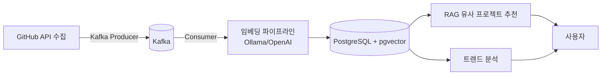

# CodeScope

GitHub 트렌딩 레포를 수집·임베딩하여 RAG 기반 유사 프로젝트 추천과 트렌드 분석을 제공하는 플랫폼.

## 왜 만들었는가

GitHub Trending은 순위만 보여줄 뿐 "왜 뜨는가", "내가 기여할 수 있는가", "내 스택과 맞는 프로젝트가 어디 있는가"는 알려주지 않는다. 실시간 수집과 AI 분석, 벡터 유사도 검색을 결합해 이 질문에 답해보려는 학습 목적 프로젝트다.

## 아키텍처



수집 → Kafka → 임베딩 → pgvector 저장 → RAG 추천 / 트렌드 분석 순으로 이어지는 파이프라인이다. 중간 단계 실패로 임베딩이 없는 레포가 섞이지 않도록, RAG 추천 쿼리는 `ProcessStatus=EMBEDDED`인 레포만 대상으로 한다.

## 기술 스택

| 기술 | 선택 이유 |
|---|---|
| Java 21 (가상 스레드) | GitHub·AI·DB 호출처럼 I/O 대기가 많은 구조에 적합 |
| Spring Boot 3.5 | 생태계와 가상 스레드 지원이 성숙한 백엔드 프레임워크 |
| PostgreSQL + pgvector | 별도 벡터 DB 없이 기존 트랜잭션 안에서 벡터 검색 처리 |
| QueryDSL | Q클래스가 컴파일 시점에 생성돼 동적 검색 조건을 타입 안전하게 조합 |
| Redis | 트렌드 랭킹(Sorted Set)·캐싱·중복 수집 방지 락에 활용 |
| Kafka | 브로커에 영속 저장되어 앱 재시작에도 작업이 유실되지 않음 |
| Flyway | 스키마 변경 이력을 코드로 관리해 팀/환경 간 정합성 확보 |
| Ollama | 로컬 환경에서 비용 없이 임베딩·생성 모델을 실험 |
| GitHub OAuth + JWT | 서비스 정체성과 맞고, 비밀번호 직접 관리 부담을 줄임 |
| Next.js | 프론트엔드 |
| kind (로컬 K8s) | 로컬에서 실제 K8s 환경을 그대로 재현 |
| GitHub Actions + ArgoCD | CI/CD와 GitOps 기반 배포 자동화 |

## 가상 스레드 활용

- **HTTP 요청 처리**: 톰캣이 요청마다 가상 스레드를 할당해, GitHub API·Ollama 호출처럼 I/O 대기가 긴 작업에서도 캐리어 스레드를 반납하고 다른 요청을 처리할 수 있게 함. 톰캣 스레드 수 자체를 줄이는 방식은 인바운드 요청까지 막아버리는 안티패턴으로 보고 채택하지 않음
- **Kafka 컨슈머 워커 분리**: `EmbedConsumer`는 poll 스레드에서 메시지를 받으면 실제 임베딩 처리는 가상 스레드 기반 `embedWorkerExecutor`로 위임한다. 재시도 백오프(최대 3회, 1s→2s 지수 백오프)로 워커가 오래 블로킹돼도 poll 스레드는 영향받지 않아 Kafka 하트비트/`max.poll.interval.ms` 초과로 인한 리밸런싱 폭주를 막는다
- **배압 제어(세마포어)**: GitHub API/OpenAI API용 세마포어와 DB 세마포어(HikariCP `maximum-pool-size`와 permits 일치)를 분리 설계해, 가상 스레드가 많아져도 하위 시스템(외부 API rate limit, DB 커넥션 풀)이 고갈되지 않도록 함
- **pinning 검증**: `synchronized`나 구버전 JDBC 드라이버는 가상 스레드를 캐리어 스레드에 고정(pinning)시켜 가상 스레드의 이점을 무력화할 수 있어, JDK Mission Control(JFR)의 `jdk.VirtualThreadPinned` 이벤트로 별도 검증

## Kafka 파이프라인

수집(Collect)과 임베딩(Embed) 두 단계를 별도 토픽으로 분리했다.

- `codescope.collect`: GitHub 레포 수집 메시지. `CollectConsumer`가 소비해 DB에 저장(fullName UNIQUE 제약으로 멱등성 보장) 후 `codescope.embed`로 다음 단계를 발행
- `codescope.embed`: 임베딩 대상 메시지. `EmbedConsumer`가 소비해 README 수집 → Ollama 임베딩 생성 → pgvector 저장까지 수행
- **재시도/DLT**: `@RetryableTopic`(3회, 1000ms 지수 백오프 ×2.0)으로 재시도 토픽을 자동 구성하고, 모두 실패하면 DLT(Dead Letter Topic)로 이동. 4xx(404/401/403)처럼 재시도해도 결과가 바뀌지 않는 에러는 즉시 최종 실패로 확정
- **오프셋 커밋 시점**: poll 스레드는 메시지를 워커에 위임만 하고, 실제 임베딩이 성공 또는 최종 실패로 확정된 뒤에야 `ack.acknowledge()`를 호출 — 처리 중인 메시지가 성급하게 커밋 완료로 처리되지 않도록 함
- Consumer 오프셋 역전을 막기 위해 메시지 "소비" 자체는 순차 처리하고(concurrency는 파티션 단위로만 확장), 가상 스레드 병렬화는 I/O 대기 지점(워커 내부)에만 적용

## N+1 문제 및 QueryDSL

`GithubRepository`-`Topic`은 `@ManyToMany(LAZY)`라 목록 조회 후 각 레포의 Topic을 순회하면 레포 개수만큼 추가 쿼리가 발생한다.

| 데이터 규모 | `findAll()` (개선 전) | `findAllWithTopics()` - JOIN FETCH (개선 후) |
|---|---|---|
| 레포 5개, Topic 5개 | 6번 (1 + 5) | 1번 |
| 레포 100개, Topic 20개 | 101번 (1 + 100) | 1번 |

페이징이 필요 없는 목록 조회는 JOIN FETCH로 해결했다. 다만 컬렉션 fetch join과 페이징을 함께 쓰면 Hibernate가 메모리 페이징을 하게 되는 문제가 있어, 페이징이 필요한 동적 검색 API(`GithubRepositoryQueryRepository`)는 QueryDSL의 `BooleanBuilder`로 조건을 조합하고 topics는 fetch 대신 `@BatchSize(size = 100)`로 배치 조회(`WHERE repo_id = any(?)` 1번)하도록 분리했다.

## 부하테스트 및 모니터링

배압 제어(세마포어)를 켰을 때와 껐을 때의 차이를 실측으로 확인하기 위해 아래 도구들을 함께 사용했다.

- **JMeter**: GUI 기반으로 시나리오 설계가 쉬워 초기 부하 시나리오 구성에 사용
- **k6**: 스크립트(JS) 기반이라 코드로 관리하고 CI에 연동하기 쉬움
- **InfluxDB + Grafana**: 부하테스트 중 응답시간/처리량을 시계열로 실시간 시각화
- **JDK Mission Control (JFR)**: 가상 스레드 pinning(`jdk.VirtualThreadPinned`) 여부를 관찰

## 성능 실측 요약

> 측정 환경: 로컬 kind 클러스터(k8s), 12 logical processors, GPU 없음(Ollama는 CPU-only 추론). 출처: `docs/performance/`

| 항목 | 조건 | 결과 |
|---|---|---|
| pgvector 검색 (DB 실행, `EXPLAIN ANALYZE`) | repo_embeddings 20행 / github_repository 30행 중 EMBEDDED 3행 | Execution Time 2.257ms |
| pgvector 검색 (앱 측, HikariCP 커넥션 포함) | 앱 재시작 후 첫 호출(콜드) | 3134ms |
| pgvector 검색 (앱 측, HikariCP 커넥션 포함) | 두 번째 호출부터(웜) | 185ms |
| RAG 생성(LLM) | llama3.2:3b, num_predict=200, 워밍업 상태 | eval 91.07초(1.68 tok/s) / 전체 142.76초 |
| 트렌드 분석 캐시 미스 | 1차 호출(LLM 실제 호출) | 71.24초 |
| 트렌드 분석 캐시 히트 | 2차 호출(Redis TTL 1시간 내) | 0.081초 (약 880배 개선) |
| DB 세마포어 배압 제어 — 없음 (JMeter, `GET /api/repos/{id}` 관찰) | useSemaphore=false | 평균 160ms / 최대 1453ms / 처리량 41.5 |
| DB 세마포어 배압 제어 — 있음 (JMeter, `GET /api/repos/{id}` 관찰) | useSemaphore=true, reserve=2, permits=8 | 평균 16ms / 최대 325ms / 처리량 89.2 |
| k6 부하테스트 (`repo-detail.js`, 세마포어 활성) | 10s ramp-up → 30s steady 10 VUs → 10s ramp-down | p(95)=285.21ms, 실패율 0%, threshold(`p(95)<500ms`, `rate<0.01`) 통과 |

## 실행 방법

로컬 kind 클러스터 기준.

```powershell
# kind 클러스터 + PostgreSQL/Redis/Kafka 등 기동
./scripts/local-up.ps1

# 종료
./scripts/local-down.ps1
```
